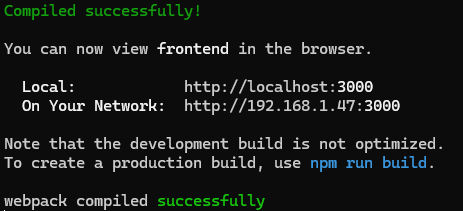

# MNSU-HLP-Spr25

## Setting Up the Project

1. Clone the repository. If you have GitHub Desktop it should be as easy as pressing the clone button. If you want to do it through command line, the link is [here](https://github.com/MNSU-HLP-Project/MNSU-HLP-Spr25).

There are two paths, one for setting up the frontend and one for the backend.

### Frontend Setup

The frontend is built using React. The steps to set up it correctly on your machine are as follows below:

1. Install Node.js on your machine. If already have node.js installed then move to the next step. If not, go to [this site](https://nodejs.org/en) and install.
2. Navigate to the ```frontend``` directory in the repo.
3. Run ```npm install --force``` TODO: Figure out dependencies issues. Not sure whey this is popping up, force is a temporary workaround.
4. Run ```npm start``` and the current React page should pop up. You will also see this in terminal.


### Backend Setup

The backend is built with Django. The steps to set up it correctly on your machine are as follows below:

1. You must have Python installed on your computer. If Python is not installed, please install it now.
2. Navigate to the main directory of the repo ```MNSU-HLP-Spr25```
3. Run the command ```python -m venv venv``` NOTE: This is for creating a virtual environment, which is highly recommended for Django. You should see a venv folder created in your repo.
4. The next step is to activate the virtual environment, which will follow different steps depending on your operating system.

WINDOWS: ```venv\Scripts\activate```

MAC: ```source venv/bin/activate```


5. Next run the command ```pip install -r requirements.txt```, this will install all the nessecary packages.
6. Run ```python manage.py runserver``` to start up the backend server which will be available at ```127.0.0.1:8000```