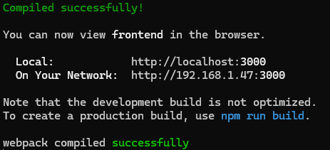

# MNSU-HLP-Spr25

## Setting Up the Project

1. Clone the repository. If you have GitHub Desktop it should be as easy as pressing the clone button. If you want to do it through command line, the link is [here](https://github.com/MNSU-HLP-Project/MNSU-HLP-Spr25).

There are two paths, one for setting up the frontend and one for the backend.

### Frontend Setup

The frontend is built using React. The steps to set up it correctly on your machine are as follows below:

1. Install Node.js on your machine. If already have node.js installed then move to the next step. If not, go to [this site](https://nodejs.org/en) and install.
2. Navigate to the ```frontend``` directory in the repo.
3. Run ```npm install```
4. Run ```npm run dev``` and the current React page should pop up. You will also see this in terminal.


### Backend Setup

The backend is built with Django. The steps to set up it correctly on your machine are as follows below:

1. You must have Python installed on your computer. If Python is not installed, please install it now.
2. Navigate to the main directory of the repo ```MNSU-HLP-Spr25```
3. Run the command ```python -m venv venv``` NOTE: This is for creating a virtual environment, which is highly recommended for Django. You should see a venv folder created in your repo.
4. The next step is to activate the virtual environment, which will follow different steps depending on your operating system.

WINDOWS: ```venv\Scripts\activate```

MAC: ```source venv/bin/activate```


5. Navigate into the backend folder ```cd backend```
6. Next run the command ```pip install -r requirements.txt```, this will install all the nessecary packages.
7. Run ```python manage.py runserver``` to start up the backend server which will be available at ```127.0.0.1:8000```

### First Steps

Before you actually start using the application you have to do two steps.
1. In your python virtual environment, navigate to the backend folder and run  ```python manage.py migrate```, this will create your database
2. Run the command of ```python create_superuser.py --username {username} --email {email} --password {password}```, replacing username, email, and password with what you want those to be. This will create a superuser that you can then log into the frontend with when both servers are started.

## Running Development Server

You will need two terminal sessions. In VS Code you can do this by just adding another terminal.

### Backend Server

1. The first step is to activate the virtual environment, which will follow different steps depending on your operating system.

WINDOWS: ```venv\Scripts\activate```

MAC: ```source venv/bin/activate```
2. Once the virtual environment is running navigate into backend folder with ```cd backend```
3. Run ```python manage.py runserver``` to start up the backend server which will be available at ```127.0.0.1:8000```

### Frontend Server

1. Navigate into frontend server in other terminal with ```cd frontend```
2. ```npm run dev``` to get the frontend server started which will be available at ```localhost:5173```


Note: There is a script called startdev.ps1 that works for some and not others. As it was outside of the scope, we didn't investigate too much, but could be worth troubleshooting.

## Considerations

The gitignore file currently keeps venv and node_modules files seperate as everyone should have their own setup of this. We also chose to ignore the db.sqlite3 file as that way every developer has their own set up of the database.

## Other Documentation

To check out more specific documenation for the frontend or backend click the links below or navigate to the README.md files of the folders.
* [Backend](backend/README.md)
* [Frontend](frontend/README.md)